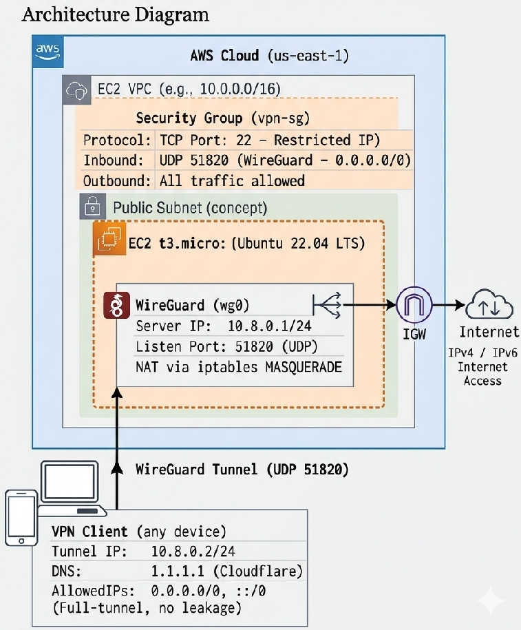

# AWS WireGuard VPN    Automated Provisioner

> **Zero-touch deployment of a private WireGuard VPN server on AWS EC2, fully orchestrated with Terraform and Bash.**

---

## Table of Contents

- [Project Overview](#project-overview)
- [Architecture Diagram](#architecture-diagram)
- [Tech Stack](#tech-stack)
- [Repository Structure](#repository-structure)
- [Key Engineering Decisions](#key-engineering-decisions)
- [Prerequisites](#prerequisites)
- [Deployment](#deployment)
- [Security Considerations](#security-considerations)
- [Future Improvements](#future-improvements)

---

## Project Overview

This project is a production-grade Infrastructure as Code (IaC) solution that automates the end-to-end deployment of a private WireGuard VPN server on AWS. The entire provisioning lifecycle    from EC2 instance creation to VPN configuration and client key distribution    is handled with a single command.

**Primary Design Goal: Zero-Touch Provisioning.**

Upon executing `terraform apply`, the following occurs automatically:

1. An EC2 instance is provisioned using the latest Ubuntu 22.04 LTS AMI (dynamically resolved).
2. WireGuard is installed and a server configuration is generated with freshly created cryptographic key pairs.
3. IP forwarding and NAT masquerading rules are applied at the kernel level.
4. A client configuration file (`client.conf`) is generated on the server, transferred to the local machine via `scp`, and is immediately ready for use with any standard WireGuard client.

---

## Architecture Diagram



---

## Tech Stack

| Layer | Technology |
|---|---|
| Cloud Provider | Amazon Web Services (AWS) |
| Infrastructure as Code | Terraform |
| Operating System | Ubuntu 22.04 LTS |
| VPN Protocol | WireGuard |
| Firewall / NAT | AWS Security Groups, `iptables` |
| Configuration Management | Bash, `cloud-init` |
| State Management | AWS S3 Backend |

---

## Repository Structure

```
.
├── instance.tf          # EC2 instance resource; file, remote-exec, and local-exec provisioners
├── InstID.tf            # Data source block for dynamic AMI resolution
├── keypair.tf           # AWS key pair resource referencing local ~/.ssh/testkey.pub
├── s3_backend.tf        # Remote S3 backend configuration for Terraform state
├── securitygroup.tf     # Security group with SSH (restricted) and WireGuard (UDP) rules
├── vars.tf              # Input variables: region, availability zone, AMI map, SSH user
├── vpn_provision.sh     # Bash provisioning script: WireGuard install, key generation, config
└── README.md
```

---

## Key Engineering Decisions

### 1. AWS Security Groups as the Sole Firewall Layer

`ufw` (Uncomplicated Firewall) is explicitly disabled, with all ingress/egress filtering delegated to AWS Security Groups. Running both `ufw` and AWS Security Groups creates a redundant "double firewall" pattern and introduces automation risk    `ufw`'s default-deny policy can cause immediate SSH lockouts when enabled non-interactively. AWS Security Groups provide the necessary perimeter control, while `iptables` handles internal packet routing.

**Security Group Rules:**

| Direction | Protocol | Port | Source |
|---|---|---|---|
| Inbound | TCP | 22 (SSH) | Operator IP only (`/32`) |
| Inbound | UDP | 51820 (WireGuard) | `0.0.0.0/0` |
| Outbound | All | All | `0.0.0.0/0`, `::/0` |

---

### 2. Native `iptables` for NAT Masquerading

Rather than using a higher-level abstraction, the provisioning script applies a NAT masquerade rule directly at the kernel level:

```bash
PostUp  = iptables -t nat -I POSTROUTING -o $INTERFACE -j MASQUERADE
PreDown = iptables -t nat -D POSTROUTING -o $INTERFACE -j MASQUERADE
```

The outbound network interface (`$INTERFACE`) is resolved dynamically at runtime using `ip route list default | awk '{print $5}'`, making the script portable across EC2 instance types and network configurations without hardcoding interface names.

---

### 3. Zero-Touch Client Configuration Delivery

The deployment pipeline eliminates all manual post-deployment steps:

1. **`file` provisioner**    transfers `vpn_provision.sh` to the instance over SSH.
2. **`remote-exec` provisioner**    executes the script, generates keys, and fixes file ownership (`chown ubuntu:ubuntu`) so the non-root user can read the generated config.
3. **`local-exec` provisioner**    runs an `scp` command from the operator's local machine to pull `client.conf` down automatically as the final step of `terraform apply`.

The operator receives a ready-to-use WireGuard client config file with no manual SSH session required.

---

### 4. Dynamic AMI Resolution

Rather than hardcoding an AMI ID (which becomes stale as Canonical releases patches), a `data "aws_ami"` block queries the AWS API at plan time to resolve the most recent Ubuntu 22.04 LTS image:

```hcl
data "aws_ami" "amiID" {
  most_recent = true
  owners      = ["099720109477"] # Canonical
  filter {
    name   = "name"
    values = ["ubuntu/images/hvm-ssd/ubuntu-jammy-22.04-amd64-server-*"]
  }
}
```

This ensures the infrastructure always provisions from a patched, non-deprecated base image without any maintenance overhead.

---

### 5. Defensive Bash Scripting Practices

The provisioning script is designed to run reliably in a stateless, automated context:

- **`set -e`**    halts execution immediately on any non-zero exit code, preventing silent failures from leaving the system in an indeterminate state.
- **`set -x`**    enables trace logging for every command, captured in `cloud-init` logs for post-deployment debugging.
- **`export DEBIAN_FRONTEND=noninteractive`**    suppresses interactive package manager prompts that would cause `apt` to hang in a non-TTY environment.
- **Quoted variable expansion**    all variables (particularly cryptographic keys) are wrapped in double quotes (e.g., `echo "$SERV_PRIV_KEY"`) to prevent Bash word-splitting from corrupting key material.

---

### 6. Remote State Management via S3

Terraform state is stored in a remote S3 backend rather than locally. This prevents `.tfstate` files    which contain sensitive infrastructure metadata including IP addresses and resource IDs    from existing on the local filesystem or being accidentally committed to version control.

---

## Prerequisites

1. **AWS CLI** installed and configured:
   ```bash
   aws configure
   ```

2. **Terraform** (v1.0+) installed.

3. **SSH key pair** generated and stored at the expected path:
   ```bash
   ssh-keygen -t ed25519 -f ~/.ssh/testkey
   ```

4. An **S3 bucket** created in your target region for the Terraform backend (update `s3_backend.tf` with your bucket name).

5. Your **public IP address** updated in `securitygroup.tf` for the SSH ingress rule to restrict access appropriately.

---

## Deployment

```bash
# Clone the repository
git clone <repo-url>
cd <repo-directory>

# Initialize Terraform and configure the remote backend
terraform init

# Preview the planned infrastructure changes
terraform plan

# Deploy the infrastructure
# client.conf will be downloaded to the current directory upon completion
terraform apply

# To tear down all resources
terraform destroy
```

Upon a successful `terraform apply`, a `client.conf` file will appear in the current working directory. Import it into any WireGuard-compatible client (desktop or mobile) to connect.

---

## Security Considerations

- **SSH access is restricted to a single IP address** (`/32` CIDR) in the security group. Update `securitygroup.tf` with your current public IP before deploying.
- **SSH private keys are never stored in the repository.** `keypair.tf` references `~/.ssh/testkey.pub` and `instance.tf` references `~/.ssh/testkey` from the local filesystem only.
- **Full-tunnel routing** is enforced on the client (`AllowedIPs = 0.0.0.0/0, ::/0`), routing all IPv4 and IPv6 traffic through the VPN to eliminate split-tunnel DNS or traffic leaks.
- **Terraform state** is stored remotely in S3, keeping infrastructure metadata off local machines and out of version control.

---